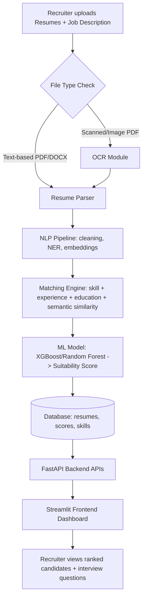

# System Architecture

## High-Level Flow

## Module Responsibilities

| Module | Responsibility | Key Tech |
|---|---|---|
| Resume Parser | Extract raw text from PDF/DOCX | pdfplumber, python-docx |
| OCR Module | Extract text from scanned/image resumes | pytesseract, pdf2image, OpenCV |
| NLP Pipeline | Clean text, extract entities/skills, generate embeddings | spaCy, Sentence-Transformers, BERT |
| Matching Engine | Combine keyword + semantic + rule-based scores | Custom Python logic |
| ML Model | Predict final suitability score (0-100) | XGBoost, Random Forest |
| Backend API | Expose endpoints, handle auth, orchestrate pipeline | FastAPI, SQLAlchemy |
| Frontend | Upload UI, dashboard, candidate detail view | Streamlit, Plotly |
| Database | Persist resumes, jobs, scores, feedback | SQLite (dev) / MySQL (prod) |

## Data Flow (step by step)

1. Recruiter logs in (JWT auth) and creates a Job Posting with a JD.
2. Recruiter uploads one or more resumes (PDF/DOCX/image).
3. Backend detects file type -> routes to Parser or OCR+Parser.
4. Parsed text goes through NLP pipeline (cleaning, NER, embeddings).
5. Matching Engine compares resume data against the JD (skills, experience, education, semantic similarity).
6. ML Model takes the matching-engine features and predicts a final suitability score.
7. Results (score, skill gaps, interview questions) are saved to the database.
8. Frontend fetches ranked candidates from the API and displays them on the dashboard.

## Scalability Notes
- OCR and NLP steps are the heaviest — these should eventually run as background/async jobs (e.g., using Celery + Redis queue) rather than blocking the upload request.
- Model inference can be separated into its own microservice if load increases.
- Caching (Redis) can avoid recomputing embeddings for the same JD repeatedly.

This document will be updated as later parts (Backend, NLP, ML, Deployment) are implemented.
